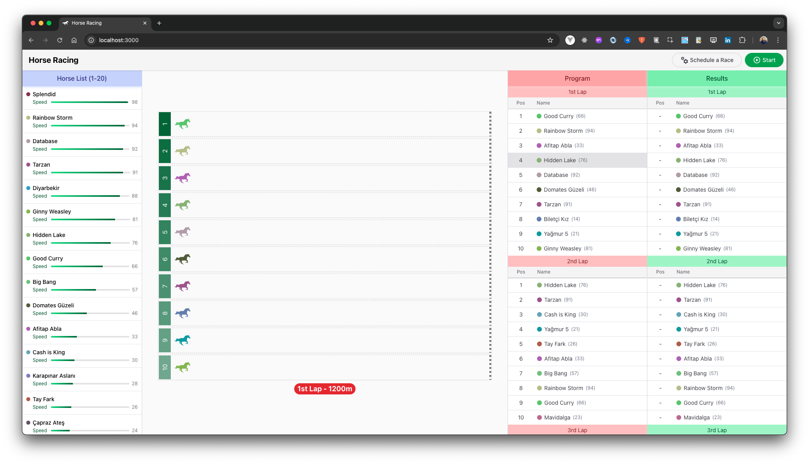
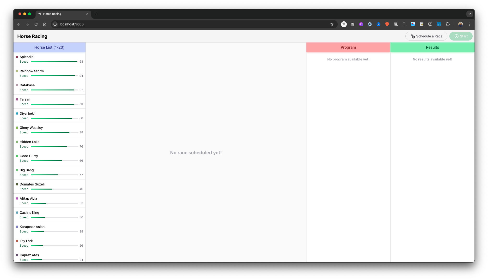
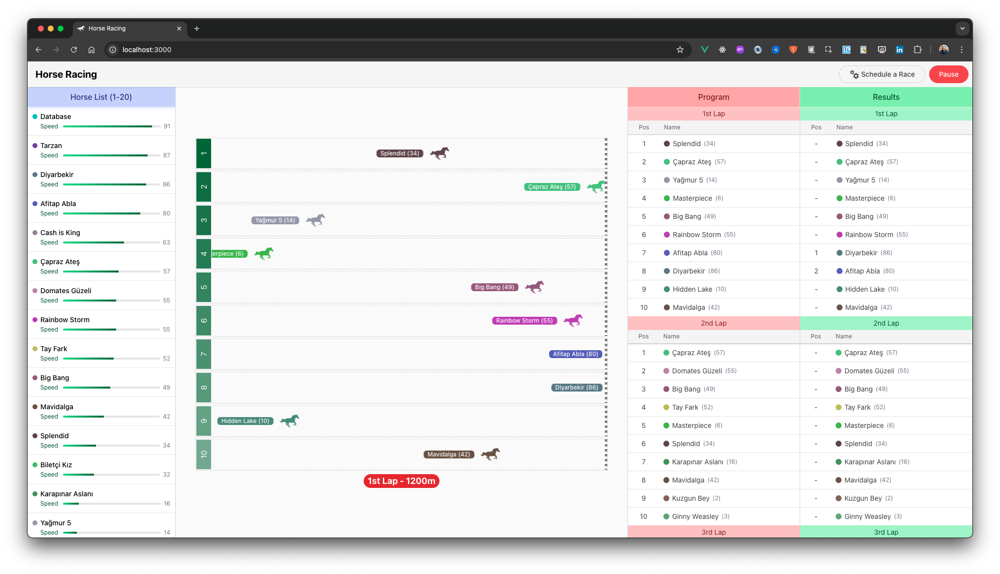

# 🏇 Horse Racing Game

Welcome to the **Horse Racing Game**, a dynamic and interactive application built with Vue.js! This game allows users to simulate horse races with animated movement, track race progress, and view detailed results.

---

### Screen 1: Main Interface


### Screen 2: Race in Progress


### Screen 3: Results View


## **Table of Contents**
1. [Features](#features)
2. [Technologies Used](#technologies-used)
3. [Project Structure](#project-structure)
4. [Installation and Setup](#installation-and-setup)
5. [Usage](#usage)
6. [Key Implementation Points](#key-implementation-points)
7. [Code Highlights](#code-highlights)
8. [Unit Tests](#unit-tests)

---

## **Features**

- 🐎 **Dynamic Horse Generation**: 20 unique horses with random names, colors, and conditions.
- 🎯 **Program-Based Races**: A total of 6 rounds with random horses selected for each round.
- ⚡ **Condition-Based Speed**: Each horse's speed is determined by its condition.
- 🎬 **Animated Horse Movement**: Smooth animations to show horse progress during the race.
- 📊 **Detailed Results**: View the finish order and status of each horse after the race.
- 📂 **Component-Based Design**: Reusable and modular Vue components for scalability.
- 🎨 **Custom Styling**: Tailwind CSS is used for consistent and clean design.

---

## **Technologies Used**

- **Vue 3**: Framework for building the user interface.
- **Vuex**: State management for the application.
- **Tailwind CSS**: Utility-first CSS framework for styling.
- **Lodash**: Utility library for data manipulation.
- **ES Modules**: For modular and organized JavaScript code.

---

## **Project Structure**

“In general, if a component contains other components, I organize those components in a folder named after the Parent Component. This helps me better understand the relationships between components.”

Here is the organized folder structure of the project:
```
src/
├── assets/
├── components/
│   ├── common/               # Shared components
│   │   ├── AppButton.vue
│   │   ├── AppHeader.vue
│   │   ├── AppIcon.vue
│   │   ├── AppTable.vue
│   │   └── Heading.vue
│   ├── GameContainer/
│   │   ├── HorseList.vue
│   │   ├── HorseNameAndColor.vue
│   │   ├── ProgramAndResultsContainer.vue
│   │   ├── RaceContainer.vue
│   │   ├── RaceTrack.vue
│   │   └── SpeedBar.vue
├── store/                   # Vuex store
│   ├── modules/
│   │   ├── horse.js
│   │   └── program.js
│   └── index.js
├── utils/                   # Utility functions
│   ├── constants.js
│   ├── helpers.js
│   └── registerComponents.js
├── App.vue
├── main.js
├── style.css
└── index.html
```

---

## **Installation and Setup**

**1. Clone the repository:**
   ```bash
    git clone https://github.com/gkandemi/horse-racing
    cd horse-racing
    npm install
    npm run dev
    http://localhost:3000
```

## **Usage**

**Schedule a Race**: Click the “Schedule a Race” button to create a 6-round race schedule.

**Start the race** and watch the horses move based on their condition.

**View Results:** After each round, see which horse finished in what position.

## **Key Implementation Points** 
•	**Dynamic Horse List:** Horses are generated with names, colors, and conditions using ``GENERATE_RANDOM_HORSES`` in **helpers.js**.

•	**Rounds:** Each round has a unique distance and randomly selected horses.

•	**State Management:** Horse data and program logic are managed in Vuex modules (horse.js and program.js).

•	**Animations:** Tailwind keyframes and animationend events are used for horse movement.

## **Code Highlights**
•	**utils/constants:** The constants for horse names and horse speed are defined here.

•	**utils/helpers.js:** “Handles core logic such as horse selection, round generation, and speed calculation. Functions that are independent of the UI or have minimal UI dependencies are defined here.” 

•	**Tailwind Animations:** Smooth and customizable animations for horse movement.


## 🧪 Unit Tests

The project includes **unit tests** to ensure that core utility functions work as expected. These tests are written using [Jest](https://jestjs.io/) and are located in the `__tests__` folder.

### **Tested Functions**
1. `GENERATE_RANDOM_HORSES`:
    - Verilen kurallara göre 20 atın rastgele oluşturulup oluşturulmadığını test eder.
    - Atların `id`, `name`, `color`, ve `condition` gibi özelliklere sahip olduğunu doğrular.

2. `SELECT_RANDOM_HORSES`:
    - 20 atlık bir listeden rastgele 10 at seçildiğini kontrol eder.
    - Seçilen atların orijinal liste içinde bulunduğunu doğrular.

3. `CALCULATE_DURATION`:
    - Verilen mesafe, hız ve container genişliği bilgilerine göre süreyi doğru hesaplayıp hesaplamadığını test eder.

### **Running the Tests**
To run the tests, use the following command:

```bash
npm run test
